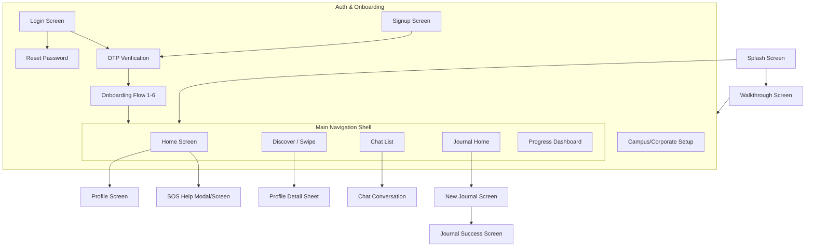

# PHASE 1: FRONTEND AUDIT & PAGE MAP

## 1. App Flow Diagram

## 2. Screen Inventory & Control Audit

| Screen File | Route / Navigation | Controls & Current Behavior | Decision | Reason |
|-------------|--------------------|-----------------------------|----------|--------|
| `splash_screen.dart` | `/splash` (Initial) | - Auto-navigates to Login after 2.5s timer. - FAKE: Does not check `FlutterSecureStorage` for an existing session token. | **REBUILD** | Needs real session check to auto-login. |
| `walkthrough_screen.dart` | `/walkthrough` | - "Next" / "Get Started" buttons. - REAL: Navigates to auth. | **KEEP** | Simple static intro page, just needs minor hookups to skip if seen. |
| `login_screen.dart` | `/login` | - Email/Pass inputs. - "Sign In" button. - REAL: Hits API, stores token, navigates to Home. | **REBUILD** | Add loading/error states, form validation. |
| `signup_screen.dart` | `/signup` | - Fields: Name, Email, Password. - Terms & Conditions Checkbox. - "Create Account" button. - FAKE: T&C checkbox doesn't block submit. | **REBUILD** | Enforce T&C, add proper validation, error handling. |
| `otp_verification_screen.dart`| `/verify-otp` | - 6-digit input. - "Verify" button. - FAKE: Relies on hardcoded "123456" in backend. | **KEEP / REBUILD** | Keep UI, but prepare for real OTP flow when backend fixes it. |
| `reset_password_screen.dart` | `/reset-password` | - Email input. - FAKE: Mock success toast, no real password reset implementation on backend. | **REMOVE** | No backend support for actually resetting the password. |
| `campus_corporate_screen.dart`| `/campus` | - "Join Network" button. - FAKE: `Future.delayed` spinner, then routes to Onboarding. | **REMOVE** | No backend support for institutional endpoints. |
| `onboarding_flow_screen.dart` | `/onboarding` | - 6 Steps (Name, Interests, Feelings, Support Types, Privacy, Notifications). - REAL: Updates via `PUT /me`. | **REBUILD** | Add robust state saving per step so drop-offs can resume. Fix mock defaults. |
| `main_navigation_shell.dart` | `/` (Shell) | - Bottom Nav Bar (5 tabs). - REAL: Changes tab state. | **KEEP** | Standard navigation shell. |
| `home_screen.dart` | Tab 0 | - Notifications icon (opens fake modal). - Profile avatar (opens drawer). - "Update Mood" (REAL: updates local state, but not persisted to DB). | **REBUILD** | Connect mood to API, render real notifications from `UserNotification`. |
| `discover_swipe_screen.dart` | Tab 1 | - Swipe Cards (Left/Right). - REAL: Hits `/match/swipe` API. | **REBUILD** | Ensure empty states work when no profiles remain. Add real loading states. |
| `chat_list_screen.dart` | Tab 2 | - List of active matches. - REAL: Fetches from `/conversations`. | **REBUILD** | Ensure real-time update when new match occurs. |
| `chat_conversation_screen.dart`| Push `/chat/:id` | - Text input & Send (REAL: Socket.io). - Voice Note button (FAKE: local Timer). - Report & Block (REAL: hits API). | **REBUILD** | Remove Voice Notes UI (no backend support). Add error states for disconnects. |
| `journal_home_screen.dart` | Tab 3 | - List of journals. - REAL: Fetches `/journal`. | **REBUILD** | Add loading/empty states. |
| `new_journal_screen.dart` | Push `/new-journal` | - Sliders for mood, text input. - "Save" button. - REAL: Hits `/journal`. | **REBUILD** | Add proper form validation and error handling. |
| `progress_dashboard_screen.dart`| Tab 4 | - Goal Checkboxes (REAL: `/goals/:id/toggle`). - XP Progress (REAL: `/progress`). | **REBUILD** | Handle XP animation sync with backend correctly. |
| `profile_screen.dart` | Drawer | - Image upload (REAL). - Edit fields (REAL). - Toggles (FAKE: Local state only). | **REBUILD** | Connect settings toggles to API (or remove them). Refactor to read from `User` model. |
| `sos_help_screen.dart` | Header Push | - Add Contact (REAL). - Call buttons (REAL: `url_launcher`). | **KEEP / REBUILD** | Validate contact form inputs. |

## 3. Items Needing Your Approval (No Backend Support)
1. **Reset Password Flow**: The UI exists, but the backend only has a dummy `/forgot-password` route that says "OTP sent" and lacks an endpoint to actually submit the new password. *Recommendation: REMOVE for now, or build the backend route.*
2. **Campus/Corporate Institutional Setup**: Entirely UI-based with a fake `Future.delayed` spinner. No backend schema or route for it. *Recommendation: REMOVE.*
3. **Voice Notes in Chat**: The UI simulates sending/receiving audio with a fake timer, but there is no audio upload endpoint or `Message` schema fields for audio. *Recommendation: REMOVE Voice Note button.*
4. **Settings Toggles**: The profile screen has toggles for push/email/SMS notifications and anonymous mode, but the backend `User` schema only stores `isAnonymous`, not the notification preferences. *Recommendation: REMOVE notification toggles from UI, keep `isAnonymous` toggle.*

---
### Next Steps
Once you approve this page map and the recommendations above, I will proceed to **PHASE 2: FOUNDATION**.
