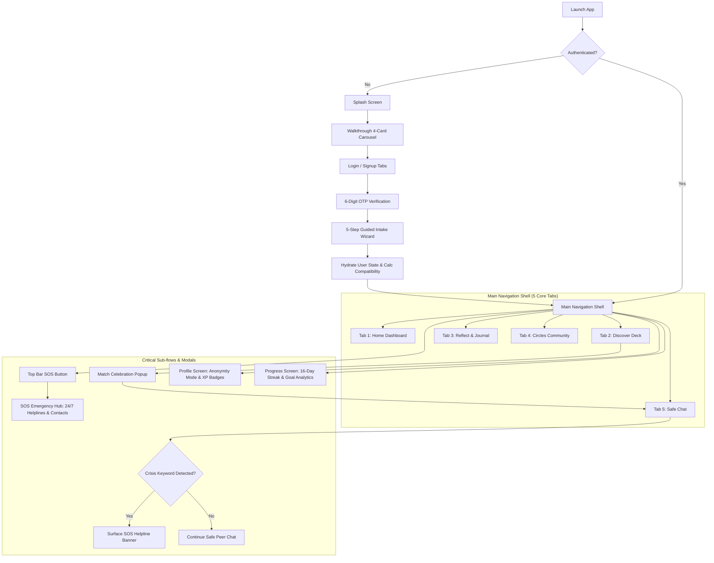
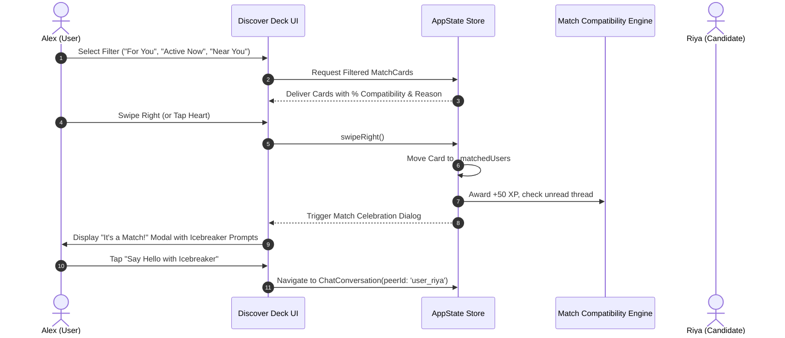
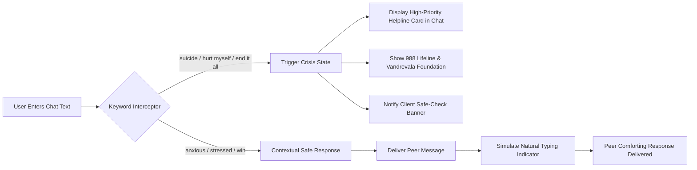
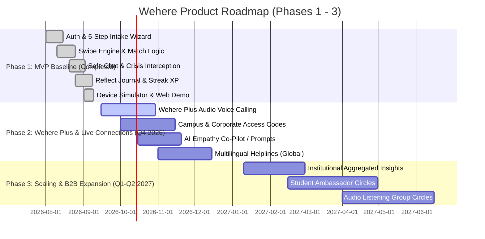

# Product Requirement Document (PRD)
## Wehere 💜 — Peer-to-Peer Emotional Wellness & Safe Connection Platform

- **Document Version**: 1.0.0
- **Document Status**: Approved / Comprehensive Baseline Specification
- **Product Owner**: Lead Product Manager
- **Engineering Target**: Flutter (iOS, Android, Web)
- **Target Audience**: Gen Z & Young Adults (18–35) seeking empathetic connection, stress decompression, and mental wellness habits

---

## 1. Executive Summary & Vision

### 1.1 Vision Statement
To create the world’s most accessible, stigma-free, and psychologically safe peer connection ecosystem—where no one has to navigate life’s quiet struggles alone.

### 1.2 Product Mission
**Wehere** bridges the massive void between clinical therapy and toxic/superficial social networks. By reimagining the intuitive swipe-card discovery model through an empathy-first lens, Wehere pairs individuals facing shared emotional hurdles (burnout, loneliness, anxiety, relationship transitions) in a safe, moderated, non-judgmental environment. Coupled with daily emotional reflection, habit streaks, and instant crisis triage, Wehere empowers users to connect, decompress, and heal together.

---

## 2. Problem Statement & Opportunity

### 2.1 The Core Problems
1. **The Modern Loneliness & Isolation Epidemic**: Over 60% of young adults report feelings of chronic loneliness and isolation, exacerbated by performative social media.
2. **The "Therapy Chasm"**:
   - High financial barriers ($100–$250 per therapy session).
   - Long waitlists (average 4–8 weeks for licensed practitioners).
   - Societal stigma and apprehension around formal clinical diagnoses.
   - Most people don't need acute hospitalization; they need **someone kind who understands what they are going through right now**.
3. **Superficial Dating / Social Apps**: Traditional swipe apps prioritize physical appearance, gamified rejection, and sexualized intent, leading to heightened anxiety, body dysmorphia, and emotional exhaustion.
4. **Safety Deficits in Anonymous Forums**: Existing anonymous forums (e.g., Reddit, Discord) frequently suffer from trolling, toxic responses, and a lack of active crisis interception when a user expresses suicidal ideation or acute distress.

### 2.2 Market Opportunity & Positioning Matrix

| Dimension | Clinical Platforms (BetterHelp, Talkspace) | Traditional Social/Dating (Tinder, Bumble) | Anonymous Support (7 Cups, Wisdo) | **Wehere (Our Product)** |
| :--- | :--- | :--- | :--- | :--- |
| **Cost / Barrier** | High subscription ($260–$360/mo) | Freemium / Ad-driven | Freemium / Volunteer queues | **Accessible / Free Tier MVP** |
| **Intent** | Clinical diagnosis & therapy | Romantic / Casual dating | Text forum / Volunteer chat | **Empathetic Peer Friendship & Wellness** |
| **Discovery Model**| Algorithmic therapist assignment | Photo-first swipe deck | Topic-based lists / Forums | **Empathy-driven Card Deck (Struggles + Values)** |
| **Privacy / Identity**| Real legal name required | Real photos & social linking | Fully anonymous (unverified) | **Hybrid Anonymity (Pseudonymous avatars or verified)** |
| **Safety Guardrails**| Clinical liability protocols | Standard report button | Volunteer moderators | **Client-side Crisis Interceptor + SOS Hub + Safe Space Pledge** |

---

## 3. Target User Personas

### Persona 1: "Burnout Alex" (Primary Discovery User)
- **Age & Demographics**: 24 years old, Associate Software Engineer / Corporate Analyst in an urban hub.
- **Pain Points**: Works 50+ hours a week, recently moved to a new city, feels overwhelmed, isolated, and drained. Reluctant to sign up for $200/hr therapy because "my problems aren't bad enough."
- **Goals**: Wants a low-pressure outlet to share quiet thoughts at 11 PM with someone experiencing similar career burnout.
- **Wehere Solution**: Filters by "Burnout" and "Someone to Talk To", matches with empathetic peers, exchanges grounding icebreakers.

### Persona 2: "Anxious Anya" (Privacy-First User)
- **Age & Demographics**: 21 years old, College Student navigating social anxiety and academic stress.
- **Pain Points**: Extreme fear of being judged by friends or family if seen on a mental health or social app. Hesitant to share personal photos online.
- **Goals**: Seeking an anonymous, safe environment to vent, log daily gratitude, and read comforting stories.
- **Wehere Solution**: Activates **Instant Anonymity Mode** (blurred photos, pseudonymous avatar handle `@quiet_compass_19`), uses the Reflect Journal and Community Circles.

### Persona 3: "Empathetic Rohan" (Supportive Peer Contributor)
- **Age & Demographics**: 26 years old, Product Specialist who overcame depression 2 years ago.
- **Pain Points**: Wants to give back and support others without being overwhelmed by toxic unsolicited messages.
- **Goals**: Desires structured, healthy boundaries while mentoring and sharing grounding routines.
- **Wehere Solution**: Earns "Safe Space Creator" and "Helpful Listener" badges, Level 12 XP progression, sends "Super Support" stars, and maintains healthy trust milestones.

---

## 4. Product Principles

1. **Safety & Zero Harm Precedes Everything**: Peer support is never a substitute for medical intervention. If acute distress is flagged, the app immediately offers certified emergency helplines without shaming or blocking the user.
2. **Empathy-First Matching**: Match scores reflect emotional resonance—shared feelings, communication styles, and mutual growth goals—never vanity metrics.
3. **Pseudonymous Comfort**: Users own their vulnerability. Anonymity is a first-class toggle, not an afterthought.
4. **Non-Punitive Habit Building**: Mental wellness is non-linear. Streaks and gamification celebrate showing up gently rather than punishing missed days.
5. **Clear Psychological Boundaries**: Safe space guidelines, mutual trust milestones, and structured wellness icebreakers protect both listeners and speakers.

---

## 5. End-to-End User Journeys & Architectural Flows

### 5.1 Global Application Flowchart


### 5.2 Discovery & Swipe Engine Flow


### 5.3 Safe Chat & Crisis Intervention Loop


---

## 6. Functional Specifications by Module

### Module 1: Authentication & Guided Intake Wizard

#### 1.1 Splash & Onboarding Walkthrough
- **Visuals**: Royal Purple gradient (`#5E4BEE` to `#7A68F8`), brand logo, and taglines.
- **Carousel Slides**:
  1. *You are not alone*: Real stories, shared healing.
  2. *Safe & Secure*: Moderated spaces, zero-tolerance for harassment.
  3. *Meaningful Connections*: Matched by struggles, not looks.
  4. *Grow Together*: Daily reflections, streaks, and milestone badges.
- **Actions**: "Get Started" (routes to Signup), "I already have an account" (routes to Login).

#### 1.2 Authentication
- **Methods**: Email / Mobile registration with tabbed Login/Signup interface.
- **Verification**: 6-digit numeric OTP verification with auto-focus inputs, 60-second resend countdown, and error highlighting.
- **Terms & Disclaimers**: Explicit acceptance of the **Safe Space Pledge** and non-clinical therapy disclaimer.

#### 1.3 5-Step Guided Intake Experience
- **Step 1 (Struggles & Feelings)**: Multi-select pill selector from 9 verified emotional states (Lonely, Anxious, Stressed, Heartbroken, Career Pressure, Family Issues, Overwhelmed, Burnout, Self Growth).
- **Step 2 (Support Style Preference)**: Select from 5 support modalities:
  - Someone to Talk To (Deep listening)
  - New Friends (Meaningful bonds)
  - Emotional Support (Guidance through tough times)
  - Accountability Partner (Daily goal motivation)
  - Motivation & Positivity (Uplifting daily energy)
- **Step 3 (Interests & Topics)**: 15 tag chips (Mental Health, Personal Growth, Mindfulness, Reading, Nature, Music, Journaling, etc.).
- **Step 4 (Photo & Profile Bio)**: Bio entry, profile avatar selection.
- **Step 5 (Instant Anonymity Mode Toggle)**:
  - When enabled: Generates a pseudonymous username (e.g., `@gentle_river_42`, `@calm_nebula_88`), blurs profile photos, and masks direct identifiable location data.
- **Dynamic Score Re-Hydration**: Upon completing onboarding, the compatibility engine recalculates match percentages across all deck candidates against the user's specific feelings and support styles.

---

### Module 2: Empathy-Driven Discovery & Swipe Deck

#### 2.1 Card Deck Mechanics
- **Physics**: Smooth drag gestures with dynamic tilt angle (left/right) and opacity indicators (Green "CONNECT" on right drag, Red "PASS" on left drag, Gold "SUPER SUPPORT" on upward fling).
- **Control Bar**:
  - Rewind Button (Undo previous pass/swipe).
  - Pass Button (Swipe Left).
  - Super Support Star (+100 XP, highlighted handshake banner).
  - Connect Heart (Swipe Right, triggers match).

#### 2.2 Compatibility Engine
- **Match Score Calculation**:
  $$\text{Score} = \text{Base (80\%)} + (\text{Shared Topics} \times 5) + (\text{Feeling Overlap} \times 5) + (\text{City Proximity} \times 3)$$
  Clamped between **82%** and **98%**.
- **Reason Card**: Surfaces an explicit compatibility narrative, e.g., *"You both share experience with Burnout & Lonely. Empathetic listener match 💜"*.
- **Category Filters**: "For You", "Active Now", "Near You", "New".

#### 2.3 Match Celebration Modal
- Dark-themed glassmorphism bottom sheet / modal.
- Dual avatar overlap animation with pulsing heart.
- Immediate actions: "Say Hello with an Icebreaker", "Keep Browsing".

---

### Module 3: Safe Peer Chat & Messaging

#### 3.1 Trust & Safety Guardrails
- **Safe Space Guidelines Banner**: Persistent or collapsible reminder at top of thread ("Be kind, respectful, and supportive").
- **Trust Milestones**: Mutual trust progression system (Level 1 Text $\to$ Level 2 Voice Notes $\to$ Level 3 Audio/Calls) unlocked after positive reciprocal interactions.
- **Disclaimers**: Inline reminder that conversations are peer-to-peer and non-clinical.

#### 3.2 Chat Interactions
- **Contextual Wellness Icebreakers**: One-tap conversation starters (e.g., *"What is one good thing that happened today? ✨"*, *"What gave you peace this week?"*).
- **Voice Notes**: Integrated audio note recording with animated waveform and duration counter.
- **Daily Wellness Tip Bar**: Ambient calming micro-tips inside the conversation thread.
- **Simulated Real-Time Responses**: Typing indicators with realistic emotional intelligence replies for demo/preview fidelity.

#### 3.3 Crisis Keyword Detection & Emergency Interception
- **Real-Time Keyword Interceptor**: Scans outgoing messages for acute distress phrases (`suicide`, `kill myself`, `want to die`, `end it all`, `self-harm`, `hurt myself`, `hopeless`, `can't go on`).
- **Immediate Intervention UI**:
  - Activates high-priority emergency helpline banner immediately in the chat thread.
  - One-tap dial for **988 Suicide & Crisis Lifeline** and **Crisis Text Line (HOME to 741741)**.
  - Does **not** abruptly block or shame the user, keeping the peer connection open while providing life-saving resources.

---

### Module 4: Reflect & Mental Wellness Layer (Journal)

#### 4.1 Daily Mood Check-In
- 5-point emotional scale with expressive claymorphic avatars:
  1. Terrible (🌧️)
  2. Anxious (🌪️)
  3. Okay (⛅)
  4. Good (☀️)
  5. Thriving (✨)
- Awards +25 XP on check-in; updates home streak and dashboard status.

#### 4.2 Interactive Journaling Flow
- **Categories**: Gratitude, Venting, Reflections, Daily Wins.
- **Prompts**: Context-sensitive thought starters.
- **"Before You Go" Grounding Checklist**:
  - Deep breath taken?
  - Drank water?
  - Unclenched jaw / dropped shoulders?
- **Celebration Modal**: "All set!" card with supportive affirmations and streak increment.

---

### Module 5: Community Circles & Safe Discussions

#### 5.1 Circle Categories
- Discussions, Anxiety & Coping, Personal Growth, Goals, Mind & Well-being.

#### 5.2 Post Creation & Feed Interactions
- Anonymous author option ("Kind Peer") or real username.
- Micro-interactions: Empathy likes (heart), supportive commenting, post bookmarking/saving.
- Zero-toxicity automated filter rejecting hostile or derogatory slurs.

---

### Module 6: Growth, Streaks & Gamification

#### 6.1 Habit Engine
- **16-Day Streak Calendar**: Non-punitive weekly visualizer (Mon–Sun). Missing a day pauses the streak rather than brutally resetting progress.
- **Level & XP System**: Level 12 "Growth Explorer" (2,350 / 3,000 XP).
  - +25 XP: Daily Mood Check-in.
  - +50 XP: Peer Match / Swipe Right.
  - +100 XP: Super Support / Complete Journal Entry.
  - +10 XP: Empathetic Chat Message.

#### 6.2 Claymorphic Achievement Badges
- **Helpful Listener**: Exchanged 50+ supportive messages.
- **Consistency Master**: Maintained a 14+ day reflection streak.
- **Safe Space Creator**: Zero reports received and signed safe space pledge.

---

### Module 7: SOS & Emergency Hub

#### 7.1 Access Points
- High-visibility pulsing red SOS icon in top navigation bar across all main screens.
- Inline chat crisis interception card.

#### 7.2 Hub Capabilities
- **24/7 Verified Helplines**:
  - National Suicide & Crisis Lifeline (988) — Call & Text.
  - Vandrevala Foundation (+91 9999 666 555) — 24/7 Free Counseling.
  - Crisis Text Line (Text HOME to 741741).
  - AASRA Helpline (+91 98204 66726).
  - The Trevor Project (LGBTQ+ Crisis Support).
- **Personal Trusted Emergency Contacts**: Add, manage, and one-tap call trusted counselors, therapists, or family members.
- **Immediate Grounding Exercise**: 4-7-8 Breathing Guide with animated visual pacer.

---

## 7. Non-Functional Requirements (NFRs)

### 7.1 Performance & Latency
- **Swipe Physics Frame Rate**: 60fps locked on iOS and Android; <16ms frame budget.
- **Chat Latency**: P95 message delivery under 200ms via WebSockets / Firebase Realtime DB.
- **Cold Start Time**: Under 1.8 seconds on standard 4G networks.

### 7.2 Security, Privacy & Anonymity
- **End-to-End Encryption**: Peer chats encrypted in transit (TLS 1.3) and at rest (AES-256).
- **Pseudonym Masking**: Zero leakage of IP address, legal name, or exact GPS coordinates when Anonymity Mode is toggled.
- **Data Minimization**: Option to purge chat history after 30 days of inactivity.

### 7.3 Compliance & Legal Safeguards
- **Non-Clinical Disclaimers**: Displayed during onboarding, chat intake, and the SOS hub.
- **GDPR & CCPA**: User data export and account deletion within 2 taps from profile settings.
- **Child Safety**: Age gate requiring users to be 18 years or older.

---

## 8. Feature Prioritization Framework (MoSCoW & RICE)

| Feature | MoSCoW | Reach | Impact | Confidence | Effort | RICE Score | Release Target |
| :--- | :--- | :--- | :--- | :--- | :--- | :--- | :--- |
| **5-Step Onboarding & Anonymity Engine** | **Must Have** | 100% | High (4) | 90% | Med (3) | **120** | Phase 1 (Live) |
| **Tinder-Style Empathy Swipe Deck** | **Must Have** | 100% | Very High (5) | 95% | Med (3) | **158** | Phase 1 (Live) |
| **Crisis Keyword Interceptor & SOS Hub** | **Must Have** | 100% | Critical (5) | 95% | Med (3) | **158** | Phase 1 (Live) |
| **Safe Peer Chat with Icebreakers** | **Must Have** | 90% | Very High (5) | 90% | Med (3) | **135** | Phase 1 (Live) |
| **Mood Check-in & Reflect Journal** | **Must Have** | 80% | High (4) | 90% | Low (2) | **144** | Phase 1 (Live) |
| **16-Day Streak & Level 12 Gamification**| **Should Have**| 70% | Medium (3) | 85% | Low (2) | **89** | Phase 1 (Live) |
| **Community Circles & Theme Feeds** | **Should Have**| 60% | Medium (3) | 80% | Med (3) | **48** | Phase 1 (Live) |
| **Audio / WebRTC Voice Peer Calling** | **Could Have** | 40% | High (4) | 70% | High (5) | **22** | Phase 2 |
| **AI Guided Empathy Coach (Co-pilot)** | **Could Have** | 50% | High (4) | 65% | High (5) | **26** | Phase 2 |
| **Licensed Therapist Hand-off API** | **Won't Have (MVP)**| 15% | Very High (5)| 50% | Very High (8)| **9** | Phase 3 |

---

## 9. Success Metrics & North Star KPIs

```
                         [ North Star Metric ]
                   Meaningful Reciprocal Connections
         (Matches exchanging ≥5 supportive messages within 24h)
                                 │
         ┌───────────────────────┼────────────────────────┐
         ▼                       ▼                        ▼
[ User Acquisition ]    [ Engagement & Habits ]  [ Trust & Safety ]
 • Onboarding completion  • 7-Day & 30-Day         • Crisis triage click-
   rate (>78%)              retention (>42%)         through rate
 • Anonymity mode adopt-  • Average daily streak   • Report rate < 0.2%
   ion rate (~45%)          length (target >8d)      of active chats
 • Swipe-to-Match ratio   • Journal entries logged • Zero safety breaches
   (healthy 20–30%)         per active user/week
```

1. **North Star Metric**: **Meaningful Reciprocal Connections (MRCs)** — defined as matches where both peers exchange at least 5 meaningful messages without receiving a report or block.
2. **Engagement & Retention**:
   - D1, D7, and D30 Retention (Target: 60%, 42%, 28%).
   - Daily Check-in Streak Completion: >3.5 check-ins/week per active user.
3. **Safety & Moderation Quality**:
   - Zero-failure Crisis Interception: 100% of crisis keyword triggers surface emergency resources within <1 second.
   - Toxic User Exclusion: <0.2% report rate per 1,000 matches.

---

## 10. Product Roadmap & Phased Rollout



- **Phase 1 (Completed Current State)**: 
  - Complete Flutter application with 5-step intake, swipe-deck matching, compatibility scoring, chat with crisis keyword interceptor, SOS emergency hub (988 & Tele-MANAS 14416), daily mood journal with private vs circle visibility, community circles, and level 12 XP progression.
  - Interactive dual-device web preview environment (`preview/`) demonstrating all 32 design mockups.
- **Phase 2 (Next Quarter — Q4 2026)**:
  - **Wehere Plus Voice Calling**: Subscription-gated opt-in anonymous voice calls connecting verified empathetic peers.
  - **Campus & Corporate Hub**: Dedicated closed networks for universities, colleges, and enterprise workplaces via access codes.
  - **AI Empathy Co-pilot**: Suggests gentle phrasing and active listening frameworks during conversations.
- **Phase 3 (Long Term — 2027)**:
  - **Institutional Wellness Portal**: Aggregated, zero-knowledge sentiment trends for university deans and HR wellness officers.
  - **Audio Listening Group Circles**: Moderated drop-in ambient voice circles for collective group reflection.

---

## 11. Peer Support Boundaries vs Clinical Medical Services

> [!IMPORTANT]
> **Strict Non-Clinical Policy: Therapist Directory Officially Removed**
> Wehere provides **purely peer-to-peer emotional support, mindful habit building, and empathetic human connection**. 
> - **We do NOT provide licensed therapists, psychotherapy, counseling sessions, psychiatric prescriptions, or medical diagnoses.**
> - All prior mentions of a "Licensed Therapist Directory" have been **permanently removed** from the application profile and database.
> - When a user is identified as experiencing an acute mental health crisis, suicidal ideation, or severe distress, the system immediately surfaces verified, external national crisis helplines (**988 Lifeline**, **14416 Tele-MANAS**, **+91 9999 666 555 Vandrevala Foundation**, and **741741 Crisis Text Line**).

---

## 12. Monetization Model: Wehere Plus & Advertising Strategy

```
+---------------------------------------------------------------------------------+
|                               WEHERE REVENUE STACK                              |
+------------------------------------+--------------------------------------------+
|        B2C: WEHERE PLUS            |            B2B: INSTITUTIONAL              |
|  ₹199/mo (Annual) or ₹299/mo (Mo)  |   Per-seat licensing for universities,     |
|       $4.99/mo International       |   colleges, schools & corporate offices    |
+------------------------------------+--------------------------------------------+
| • Instant Voice & Audio Calling    | • White-labeled verified campus circles    |
| • Unlimited Deck Rewinds           | • Zero-Knowledge student/employee privacy  |
| • 100% Ad-Free Healing Experience  | • Aggregated sentiment & burnout trends    |
| • 3 Daily Super Support Stars      | • Custom escalation to internal counseling |
| • Advanced Habit & Streak Analytics| • Dedicated onboarding & wellness weeks    |
+------------------------------------+--------------------------------------------+
```

### 12.1 Free Tier Non-Intrusive Advertising Placements
Advertising in Wehere must respect the emotional sensitivity of mental wellness:
1. **Community Circles Native Feed**: A quiet, respectful sponsored card (e.g., organic herbal teas, certified mindfulness journals, sleep soundscapes) appears every 8 to 10 community posts.
2. **Discover Swipe Deck**: One sponsored wellness partner card appears every 15 peer swipes.
3. **Daily Reflection Completion**: Optional rewarded audio meditation or gentle mindfulness sponsor at the conclusion of a completed check-in.

### 12.2 Strict Zero-Ad Safe Havens
To protect user vulnerability, ads are **strictly prohibited** in the following zones under all circumstances:
- ❌ **SOS Help Hub & Crisis Resources**: Zero commercial elements during distress.
- ❌ **1-on-1 Private Peer Chats**: Completely ad-free healing conversation space.
- ❌ **Private Self-Care Journal**: Zero interruptions while recording intimate feelings.

---

## 13. Algorithmic Specifications

### 13.1 Progress & Performance Calculation Algorithm
The user's **Weekly Wellness Index** (e.g., 72% On Track) is calculated transparently using a weighted multi-pillar formula:

$$\text{Weekly Index \%} = (\text{Self-Care Goals} \times 0.50) + (\text{Streak Consistency} \times 0.30) + (\text{Reflection Habits} \times 0.20)$$

Where:
- **Self-Care Goals (50% Weight)**: The average completion rate of active daily micro-goals:
  $$\text{Goals} = \frac{\sum_{i=1}^{n} \text{goal\_progress}_i}{n}$$
- **Streak Consistency (30% Weight)**: Consistency over the rolling 7-day wellness cycle:
  $$\text{Streak} = \min\left(1.0, \frac{\text{active\_days\_last\_7\_days}}{7}\right)$$
- **Reflection Habits (20% Weight)**: Adherence to mindful journaling and emotional logging:
  $$\text{Reflection} = \min\left(1.0, \frac{\text{journal\_entries\_this\_week}}{4}\right)$$

### 13.2 Journal Privacy & Visibility Architecture
Every journal entry is governed by an explicit privacy protocol:
- **🔒 Private to You (Default)**:
  - Encrypted locally on device.
  - Invisible to all other users, search engines, and community circles.
  - Stored strictly for personal emotional trend analytics and self-reflection.
- **👥 Share Anonymously to Circles (Opt-In)**:
  - Requires active toggle switch selection by the author.
  - Strips user identity, user handle, and email.
  - Broadcasts story to the Community Circle with a randomized empathetic pseudonym (e.g. *"Kind Soul 🌿"*) to foster collective peer healing.
